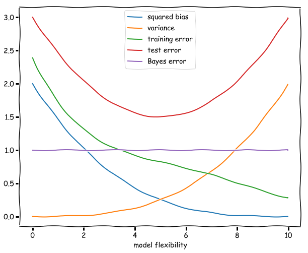

```{r setup, include=FALSE}
library("reticulate")
rmarkdown::render
knitr::knit_engines$set(python = reticulate::eng_python)
#tinytex::install_tinytex()
```


## Problem 1

### Task a

Load the data set in npf_train.csv:
```{python}
import pandas as pd

npf = pd.read_csv("npf_train.csv")
```

### Task b

Modify and look at dataframe:
```{python}
npf
npf = npf.set_index("date")
npf = npf.drop("id",axis=1)
npf
```

### Task c

Plotting:
i.-iii.
```{python}
import matplotlib.pyplot as plt
import seaborn as sns

npf.describe()
npf = npf.drop("partlybad",axis=1)

sns.pairplot(npf,hue="class4",vars=npf.columns[1:6],kind="reg")

npf.boxplot(column="RHIRGA84.mean",by="class4")
```

iv.
```{python}
import numpy as np
class2 = np.array(["nonevent", "event"])
npf["class2"] = class2[(npf["class4"]!="nonevent").astype(int)]

npf.boxplot(column="CS.mean", by="class2")
```

v.
```{python}
sns.displot(npf, x="class4")

sns.displot(npf, x="class2")
```

vi. Non-events and events occur the same amount. Among the events the most common event type is II, second is Ib and last Ia.


## Problem 2

### Task a

As an extra model I used Ridge regression.

```{python}
import os
from urllib.request import urlretrieve

import numpy as np
import pandas as pd

from sklearn.dummy import DummyRegressor
from sklearn.linear_model import LinearRegression, Ridge
from sklearn.svm import SVR
from sklearn.ensemble import RandomForestRegressor
from sklearn.model_selection import train_test_split, cross_val_score
from sklearn.metrics import mean_squared_error

file = "Bias_correction_ucl.csv"

nwp = pd.read_csv(file)
nwp = nwp.drop(["Date", "Next_Tmin"], axis=1)
nwp = nwp.dropna()

#Downsample
nwp, _ = train_test_split(
    nwp, train_size=1000, random_state=42, stratify=nwp["station"]
)

#Splitting data to train and test
X = nwp.drop(["Next_Tmax", "station"], axis=1)
y = nwp["Next_Tmax"]
X_train, X_test, y_train, y_test = train_test_split(
    X, y, train_size=500, random_state=42, shuffle=True, stratify=nwp["station"]
)

models = [DummyRegressor(), LinearRegression(), SVR(), RandomForestRegressor(), Ridge()]
res = pd.DataFrame(index=["dummy", "OLS", "SVR", "RF", "Ridge"])

#Mean squared error function
def loss(X_tr, y_tr, X_te, y_te, m):
    return mean_squared_error(y_te, m.fit(X_tr, y_tr).predict(X_te), squared=False)

#Losses and cross-validation
res["train"] = [loss(X_train, y_train, X_train, y_train, m) for m in models]
res["test"] = [loss(X_train, y_train, X_test, y_test, m) for m in models]
res["cv_10"] = [
    -cross_val_score(
        m, X_train, y_train, cv=10, scoring="neg_root_mean_squared_error"
    ).mean()
    for m in models
]
res["cv_1out"] = [
    -cross_val_score(
        m, X_train, y_train, cv=X_train.shape[0], scoring="neg_root_mean_squared_error"
    ).mean()
    for m in models
]

res

```

### Task b

Random forest regressor is clearly the best in train, test and validation errors. Close second is Linear regression and Ridge. Ridge regression and linear regression are very similar algorithms and their scores are almost the same in all sets.
RMSE on the training data is very similar to the RMSE on the test data. On random forest regressor the difference is, however, quite noticable, giving it's high complexity.
CV error is very comparable to the error on the test set. CV error on leave_one_station_out is very noticably lower than 10-fold CV error.
Given these observations the linear regression model is very efficient and low in complexity while Support vector regression is as inefficient as the dummy model. Random forest classifier seems very good from the training data, but test and cross-validation data gives us a bit more clearer view and the difference between it and the linear regression model is not too great. The main choice is going to be which of these regressors you use depending on what you value more, time or error.

### Task c

Leave-one-station-out cross-validation is cross-validation where you, instead of splitting the dataset into 5-10 parts you split the dataset into how many datapoints you have. Then validate the data compairing all datapoints to one datapoint, one at a time, going through the whole dataset. In Cho et al., the authors used this method to compare to the more common 5-10-fold cross-validation methods.


## Problem 3

### Task a

```{python}
import numpy as np
import pandas as pd

from sklearn.model_selection import train_test_split


def create_dataset(n):
  x = np.random.uniform(-3, 3, n)
  e = np.random.normal(0, 0.4, n)
  fx = 2-x+x**2
  y = fx + e
  df = pd.DataFrame(columns=["x", "y"])
  df["x"] = x
  df["y"] = y
  return df
  
df = create_dataset(1020)

df

X = df["x"]
y = df["y"]

X, X_test, y, y_test = train_test_split(
    X, y, train_size=20, random_state=42, shuffle=True
)

X_train, X_val, y_train, y_val = train_test_split(
    X, y, train_size=10, random_state=42, shuffle=True
)

```

### Task b

```{python}
import matplotlib.pyplot as plt

polys = [1, 2, 3, 4, 8]
models = []
  
for poly in polys:
  fig, ax = plt.subplots()
  ax.scatter(X_train, y_train)
  
  pf = np.polyfit(X_train, y_train, deg=poly)
  models.append(pf)
  
  lin = np.linspace(-3, 3, num=256)
  ax.plot(lin, np.polyval(pf, lin), color="k")
  plt.show()

```

### Task c

```{python}
from sklearn.model_selection import cross_val_score
from sklearn.metrics import mean_squared_error

def loss(X_tr, y_tr, X_te, y_te, m):
  return mean_squared_error(y_te, np.polyval(m, X_te), squared=False)

res = pd.DataFrame(columns=polys)

res.loc["train"] = [loss(X_train, y_train, X_train, y_train, m) for m in models]
res.loc["val"] = [loss(X_train, y_train, X_val, y_val, m) for m in models]
res.loc["test"] = [loss(X_train, y_train, X_test, y_test, m) for m in models]

res
```

### Task d

```{python}
from sklearn.preprocessing import PolynomialFeatures
from sklearn.linear_model import LinearRegression
from sklearn.pipeline import make_pipeline
from sklearn.datasets import make_regression

X_comb = pd.concat([X_train, X_val])
y_comb = pd.concat([y_train, y_val])

X_poly = pd.DataFrame(X_comb)

cross_score = []
for poly in polys:
  linear = LinearRegression()
  Xd = PolynomialFeatures(poly).fit_transform(X_poly)
  cross_score.append(-cross_val_score(linear, Xd, y_comb, cv=5).mean())

res.loc["cv"] = cross_score


res.loc["comb_test"] = [loss(X_comb, y_comb, X_test, y_test, m) for m in models]
res
```

### Task e

Polynomial of 4 seems to be the winner in every category and would suit the model the best. Even if test set wouldn't be available.


## Problem 4

### Task a



- Squared bias: Average accuracy of the model increases when flexibility increases.
- Variance: Variance on the other hand decreases as flexibility increases since these models will be more drastic in correlation to the training data.
- Training error: Decreases since more flexible model can adjust to training set better.
- Test error: First decreases but then increases since too flexible model starts making too drastic changes based on the training data.
- Bayes error: Always constant. Just some noice.


## Problem 5

### Task a

$$E[L_{test}] = E[\frac{1}{m}\sum_{i=1}^{m}(\bar{y}_i - \hat{\beta}^T{\bar x}_i)^2 ] = \frac{1}{m}\sum_{i=1}^{m}E [(\bar{y}_i - \hat{\beta}^T{\bar x}_i)^2 ] = \frac{1}{m}(E[(\bar{y}_1 - \hat{\beta}^T{\bar x}_1)^2] + ... + E[(\bar{y}_n - \hat{\beta}^T{\bar x}_n)^2]) = E[(\bar{y}_1 - \hat{\beta}^T{\bar x}_1)^2]$$

### Task b

To prove that estimate of $L_{test}$ is an unbiased estimate of the generalization error for the OLS regression, we have to prove that $$E[\frac{1}{m}\sum_{i=1}^{m}(\bar{y}_i - \hat{\beta}^T{x}_i)^2] = E[\frac{1}{n}\sum_{i=1}^{n}(y_i-\hat{y}_i)^2 ]$$.
From the modification we did to $L_{test}$ in task a we can see that $E[y_i] = E[y]\ \forall i$ and $\hat{\beta}^T{x}=\hat{y}$. From this we can state that the equation $$E[L_{test}] = E[(y-\hat{y}^2)]$$.

### Task c

We must prove: $$ E[\frac{1}{n}\sum_{i=1}^{n}(y_i-\hat{\beta}^T\bar{x}_i)^2] \leq E[\frac{1}{m}\sum_{i=1}^{m}(\bar{y}_i - \hat{\beta}^T\bar{x}_i)^2]$$

The only term possible to affect this equation is $\hat{\beta}^T$. From Problem 4 task a we can see that the this term favors the training set; Because of $\hat{\beta}^T$ the loss is always less or equal to the test set. So $\hat{\beta}^T_{train} \leq \hat{\beta}^T_{test}$.

### Task d

The previous task is related to the generalization problem in machine learning since it means that the difference between test and train results has to be found between bias and variance so that the model is not too fitting to training data (overfitting) or too general (underfitting).


## Problem 6

### Task a

```{python}
import numpy as np
import pandas as pd

data = pd.read_csv("co2lite.csv")

y_pred = [np.mean(data["FCO2"]) for i in data["FCO2"]]
difference = data["FCO2"] - y_pred
std = difference.std(ddof=1)
t_value = (np.mean(difference))/(std/np.sqrt(len(difference)))

np.mean(data["FCO2"])
t_value
std
```

With this few datapoints it's not yet possible to state that the true mean of FCO2 is non-zero.


## Problem 7

The beginning of this course has really hooked me in and it's starting to seem like it's my favourite course this far. I have learned and understood many of the beginning principles of machine learning and supervised learning. Bits of the math side is always hard but with time I will hopefully understand those as well. I have thought about including a bit of machine learning to my bachelor's thesis so this knowledge will be very useful.
