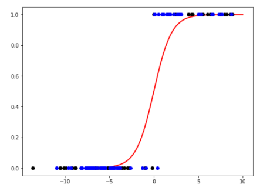

```{r setup, include=FALSE}
library("reticulate")
rmarkdown::render
knitr::knit_engines$set(python = reticulate::eng_python)
#tinytex::install_tinytex()
```

## Problem 8

### Task a

```{python, eval=FALSE}
import math
import pandas as pd
from sklearn import linear_model
from sklearn.metrics import accuracy_score

spam_train = pd.read_csv("spam_train.csv")
spam_test = pd.read_csv("spam_test.csv")

clf = linear_model.LogisticRegression(penalty="l1", C=1/0.001, solver="saga", max_iter=2000)

X_train = spam_train.iloc[:,:5]
y_train = spam_train.iloc[:,5]
X_test = spam_test.iloc[:,:5]
y_test = spam_test.iloc[:,5]

clf.fit(X_train, y_train)

print("Intercept", clf.intercept_[0])
print("Coefficients:")
for c, v in zip(spam_test.columns[:5], clf.coef_[0]):
  print(c, v)
  
pred_train = clf.predict(X_train)
train_acc = accuracy_score(y_train, pred_train)
pred_test = clf.predict(X_test)
test_acc = accuracy_score(y_test, pred_test)

print("Accuracy train:", train_acc)
print("Accuracy test:", test_acc)

phat_train = clf.predict_proba(X_train)[:,1]
phat_test = clf.predict_proba(X_test)[:,1]

per_train = 0
for i in phat_train:
  per_train += math.log(i)
print("Perplexity train:", -per_train)

per_test = 0
for i in phat_test:
  per_test += math.log(i)
print("Perplexity test:", -per_test)
```

Convergence warning is due to hitting the iteration limit on the logistic regression model. By increasing iterations limit we can solve this warning. Plot:



### Task b

```{python, eval=FALSE}
lasso = linear_model.Lasso(alpha=0.1)

lasso.fit(X_train, y_train)

for c, v in zip(spam_test.columns[:5], lasso.coef_):
  print(c, v)

pred_train = lasso.predict(X_train)
pred_test = lasso.predict(X_test)

lassoper_train = 0
for i in pred_train:
  lassoper_train += math.log(i)
print("Perplexity train:", -lassoper_train)

lassoper_test = 0
for i in pred_test:
  lassoper_test += math.log(i)
print("Perplexity test:", -lassoper_test)
```

alpha=0.1, for example, gives all but T_FILL_THIS_FORM_SHORT coef to 0/-0.


## Problem 9 TODO

### Task a


## Problem 11

### Task a

The authors say that the difference between discriminative and generative learning model isn't always clear even though many seem to think that discriminative is obviously better. The larger the dataset the larger asymptotic error the generative model has, over the discriminative model, but if the generative model has already reached its asymptotic error it usually performs better.

### Task b

$h_{Gen}$: a generative model chosen by optimizing the joint likelihood of the inputs and the labels.
$h_{Dis}$: a discriminative model chosen or by optimizing the conditional likelihood or minimizing the 0-1 training error.

### Task c

In these graphs the x-axis is "m"; random samples from train/test splits, and y-axis which is the error of the Naive Bayes and Logistic Regression models. Results of these graphs are very mixed. Notable ones are `liver disorders` and `lenses`, where Logistic Regression starts performing better from a certain m, which is what we discussed in Task a.


## Problem 12

### Task a

For Naive Bayes assumption the data would have to be conditionally independent, given class. In this dataset, each datapoint is created independently from the normal distribution and hence the Naive Bayes assumption is fulfilled.

### Task b

```{python, eval=FALSE}
import numpy as np
import pandas as pd
from sklearn.naive_bayes import GaussianNB
from sklearn.linear_model import LogisticRegression
from sklearn.dummy import DummyClassifier
from sklearn.neighbors import KNeighborsClassifier

ns = [2**i for i in range(3,13)]
data = [pd.read_csv(f'toy_train_{n}.csv') for n in ns]
data_test = pd.read_csv("toy_test.csv")
y_test = data_test["y"]

phat = lambda m: [
  m.fit(d.iloc[:, :2], d["y"]).predict_proba(data_test.iloc[:, :2])[:, 1]
  for d in data
]

accuracy = lambda p: (y_test * np.round(p) + (1 - y_test) * (1 - np.round(p))).mean()
perplexity = lambda p: np.exp(-np.mean(np.log(y_test*p + (1 - y_test) * (1 - p))))

m_NB = GaussianNB()
m_LR = LogisticRegression(penalty="none", solver="newton-cg")
m_LRx = LogisticRegression(penalty="l2", solver="newton-cg")
m_NBx = GaussianNB(priors=[0.4, 0.6])
m_D = DummyClassifier()
m_kNN = KNeighborsClassifier()

# Store results in a pandas dataframe
res_acc = pd.DataFrame(index=ns)
res_perp = pd.DataFrame(index=ns)
res_acc["NB"] = [accuracy(p) for p in phat(m_NB)]
res_perp["NB"] = [perplexity(p) for p in phat(m_NB)]
res_acc["LR"] = [accuracy(p) for p in phat(m_LR)]
res_perp["LR"] = [perplexity(p) for p in phat(m_LR)]
res_acc["LR inter"] = [accuracy(p) for p in phat(m_LRx)]
res_perp["LR inter"] = [perplexity(p) for p in phat(m_LRx)]
res_acc["NB prior"] = [accuracy(p) for p in phat(m_NBx)]
res_perp["NB prior"] = [perplexity(p) for p in phat(m_NBx)]
res_acc["Dummy"] = [accuracy(p) for p in phat(m_D)]
res_perp["Dummy"] = [perplexity(p) for p in phat(m_D)]
res_acc["kNN"] = [accuracy(p) for p in phat(m_kNN)]
res_perp["kNN"] = [perplexity(p) for p in phat(m_kNN)]

res_acc
res_perp
```

### Task c

- The logistic regression with interaction terms didn't differ much from the LR with interaction terms.
- Probabilistic and generative models were the NB models, where as kNN and LRs were discriminative models.
- The perplexities had more interesting outcomes and differences. The higher the accuracy the lower the perplexity.
- The accuracies were so similar that no difference as in problem 11 were seen.
- Interaction term did not perform majorly different.
- Dummy classifier outperformed the kNN in toy_train_16 dataset. Otherwise the accuracy was very far off. Perplexity was however closer.
- Naive Bayes and Logistic Regression go hand in hand in the accuracy and perplexity.


## Problem 13 TODO
## Problem 14 TODO
## Problem 15 TODO
## Problem 16

I learned about the classification models and how to utilize them. Following the lectures, I was especially surprised how effective the naive Bayes was. I will most likely utilize it more in the future. Exercises were more challenging than sets 0 and 1, but in a good way. I really like the premade code with things that you need to add to get the full results. It is a way of visual learning and helps me understand the scope of the exercise.