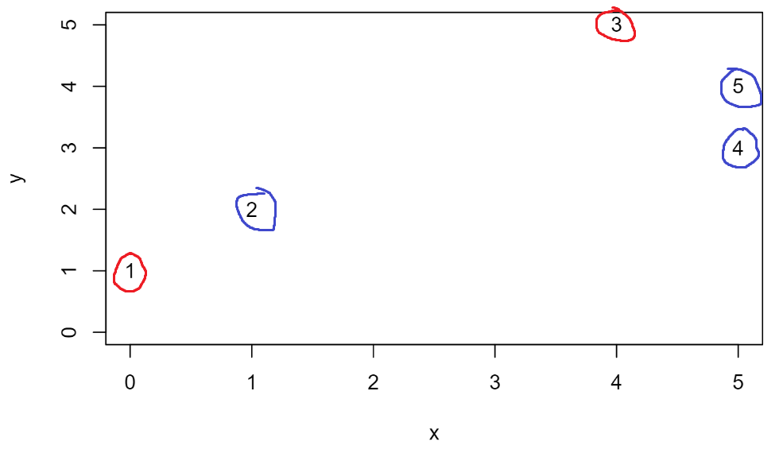
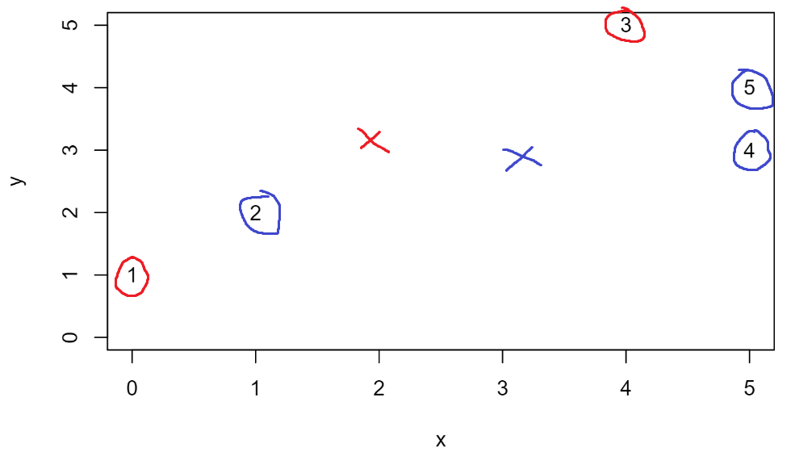
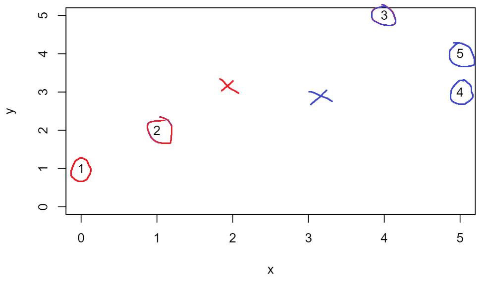
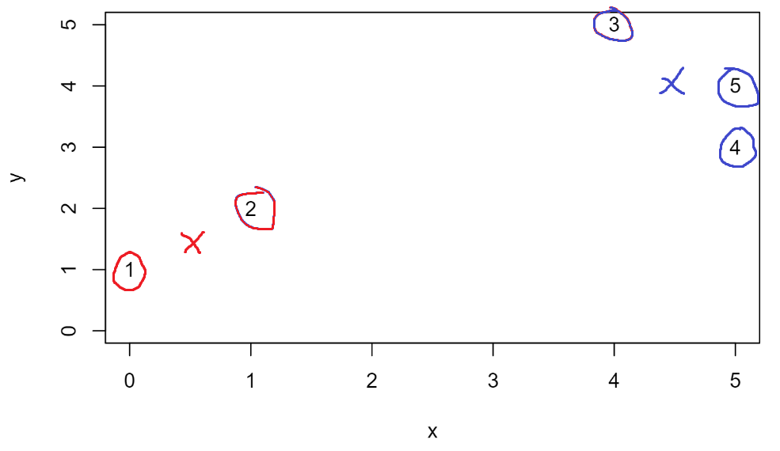
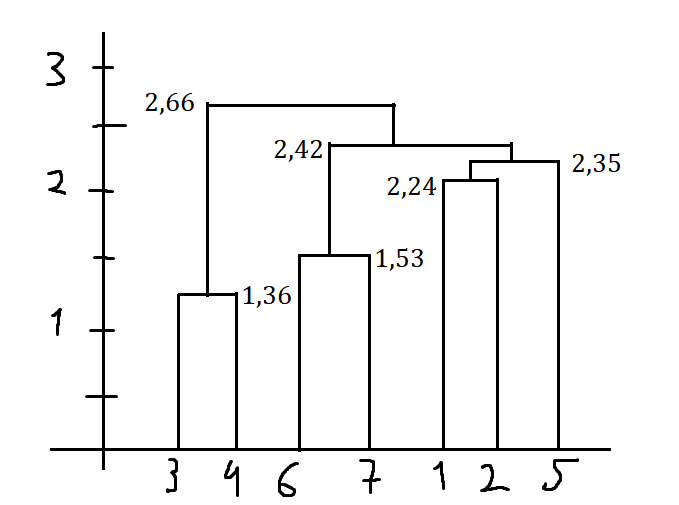
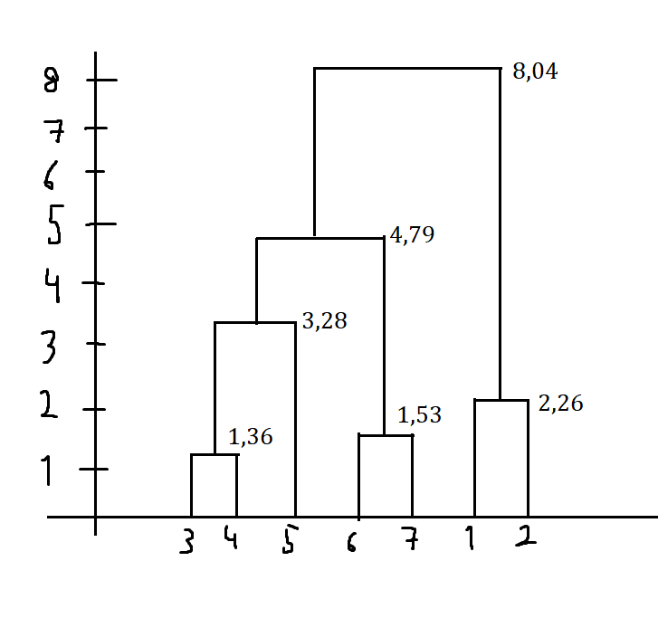

```{r setup, include=FALSE}
library("reticulate")
rmarkdown::render
knitr::knit_engines$set(python = reticulate::eng_python)
#tinytex::install_tinytex()
```

## Problem 17

### Task a

We can use k-means for clustering, grouping into k-amount of groups data based on similarities. K-means works by finding a set of centroids for these clusters, so that the loss function is minimized. Lloyd's alorithm is one way to calculate the centroids for k-means. It works by assigning data points to random clusters. After that it sets each cluster centroid to average of the points in the cluster and assigns each data point to the closest centroid, until convergence.

Inputs for the algorithm are the data and k (n# of clusters). Output is the clustering. The results are an approximation of the true clustering.

### Task b

Cost function: $$L_{kmeans}=\sum_{i=1}^{n}\parallel x_i-\mu_{j(i)}\parallel_2^2$$

When we assign the point i to the closest centroid we are minimizing $\parallel x_i-\mu_{j(i)}\parallel_2^2$. When we choose $\mu_j$ to be the mean of the points we are minimizing $\parallel x_i-\mu_{j}\parallel_2^2$. The algorithm is finite and will stop, usually sooner than later.

### Task c

{width=450px}

Now we set every centroid to the average of the points in the cluster. We can calculate this by $$x_m=\frac{1}{n}\sum_{i} x_i\ \ \ y_m=\frac{1}{n}\sum_{i} y_i$$
In figure 2, the red centroid is now positioned in $(2,3)$, since this is the average of $(0,1)$ and $(4,5)$, and the blue centroid is positioned in $(3,3)$, since this is the average of $(1,2)$, $(5,3)$ and $(5,4)$.

{width=450px}

Now we assing the points to the nearest centroid. Distance between a point and a centroid can be calculated by: $$\sqrt{(x_1-x_2)^2 + (y_1-y_2)^2}$$

{width=450px}

The new centroids are $\mu_{red}=(0.5,1.5)$ and $\mu_{blue}=(4.5,4)$.

{width=450px}

Next step converges and stops the algorithm.


## Problem 18

### Task a

{width=450px}

The algorithm works as follows:
1. clustering of 3 and 4, with a joint cost of 1.36
2. clustering of 6 and 7, with a joint cost of 1.53
3. clustering of 1 and 2, with a joint cost of 2.24
4. clustering of 5 and (1,2), with a joint cost of 2.35, that is the distance between 2 and 5
5. clustering of (5, (1,2)) and (6,7), with a joint cost of 2.42, that is the distance between 5 and 6
6. clustering of 2.66, that is the distance between 4 and 6

### Task b

{width=450px}
The algorithm works as follows:
1. clustering of 3 and 4, with a joint cost of 1.36
2. clustering of 6 and 7, with a joint cost of 1.53
3. clustering of 1 and 2, with a joint cost of 2.24
4. clustering of 5 and (3,4), with a joint cost of 3.28, that is the distance between 4 and 5
5. clustering of (5, (3,4)) and (6,7), with a joint cost of 4.79, that is the distance between 3 and 7
6. clustering with a joint cost of 8.04, that is the distance between 1 and 7


## Problem 19

### Task a

```{python}
import pandas as pd
import numpy as np
from sklearn import preprocessing
import matplotlib.pyplot as plt

npf = pd.read_csv("npf_train.csv")
del npf['id']
del npf['partlybad']
del npf['date']
y = npf['class4'].astype('category')

npf = npf[[c for c in npf if 'mean' in c]].rename(columns= lambda x: x.replace('.mean', 'mean'))

npf = pd.concat([npf, y], axis=1)
colss = npf.columns.difference(['class4'])
scaled = preprocessing.scale(npf[npf.columns.difference(['class4'])])

npf['class4'] = npf['class4'].cat.codes
```

Plotting:
```{python}
from sklearn.cluster import KMeans

toplotY_un = []
toplotX_un = []
toplotX_sc = []
toplotY_sc = []
for i in range(1, 21):
    km = KMeans(n_clusters=i).fit(npf[npf.columns.difference(['class4'])])
    toplotY_un.append(-1*km.score(npf[npf.columns.difference(['class4'])]))
    toplotX_un.append(str(i))

    km = KMeans(n_clusters=i).fit(scaled)
    toplotY_sc.append(-1*km.score(scaled))
    toplotX_sc.append(str(i))

plt.plot(toplotX_un, toplotY_un, label='Not normalized')
plt.plot(toplotX_sc, toplotY_sc, label='Normalized')
plt.legend()
plt.show()
```

Normalization made impact to the result. On the normalized data the loss was very minimal (not probably even showing on the plot) compared to the huge loss on the non-normalized data. Non-normalized data loss started to fall of drastically the more number of clusters there is but still the loss was huge.

### Task b

```{python}
from sklearn.metrics import confusion_matrix
import seaborn as sns

km = KMeans(n_clusters=4).fit(scaled)
y_pred = km.predict(scaled)
y_true = training_set['class4']

cm = confusion_matrix(y_true, y_pred)

new_cm = [[67, 28, 21, 1], [2,16,9,2], [1,12,56,14], [23,24,88,94]]
plt.figure(figsize=(10,10))
sns.heatmap(new_cm, annot=True)
plt.show()
```

From this matrix it's pretty clear that the most errors happen were the values outside the diagonal are higher. This is particularly true for the last row: the first, second and third values are in fact wrong "predictions" with a really high count.
